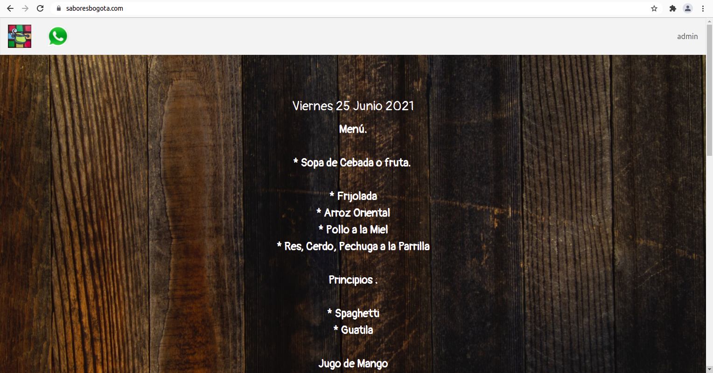
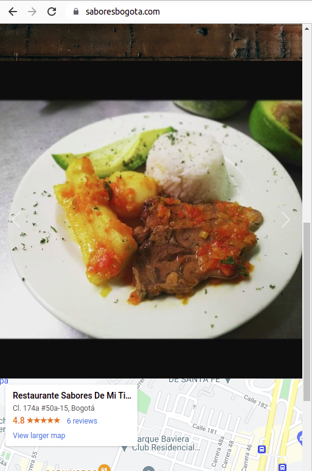
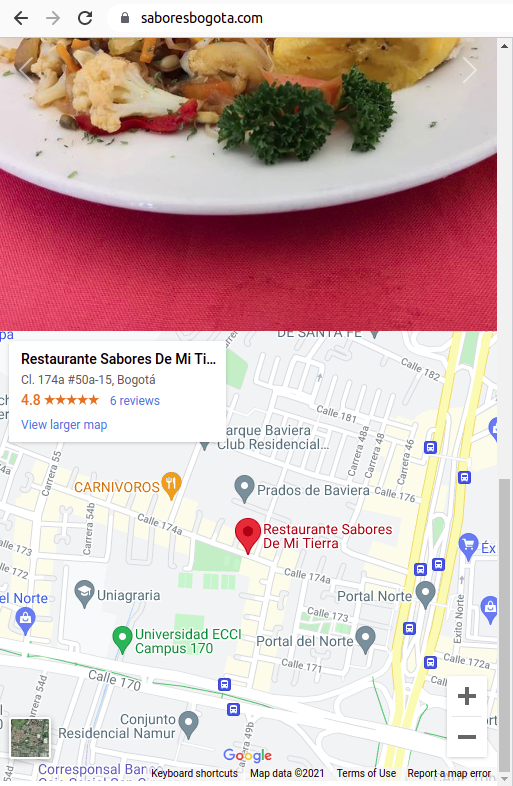
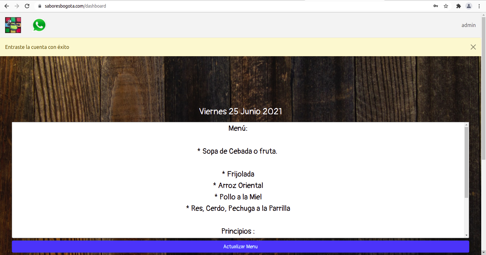
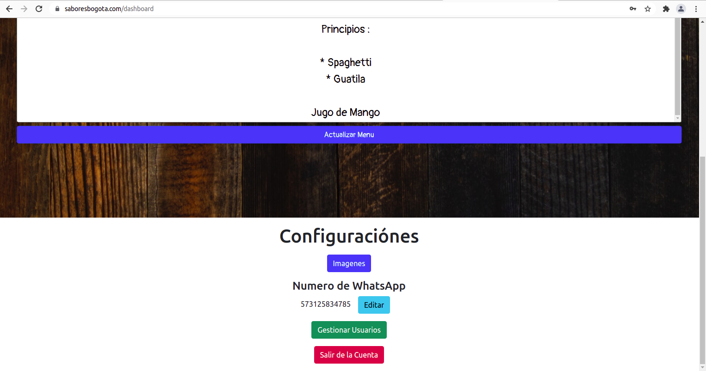
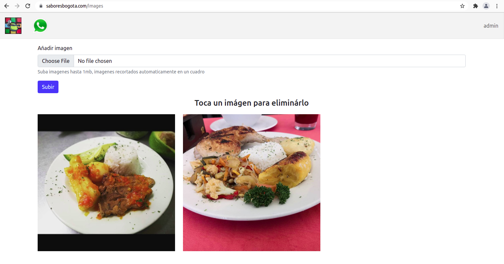
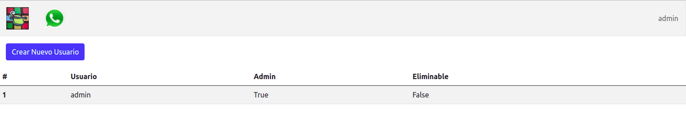
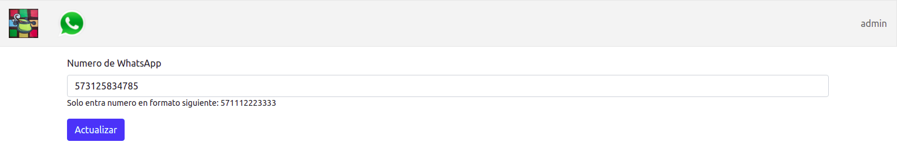
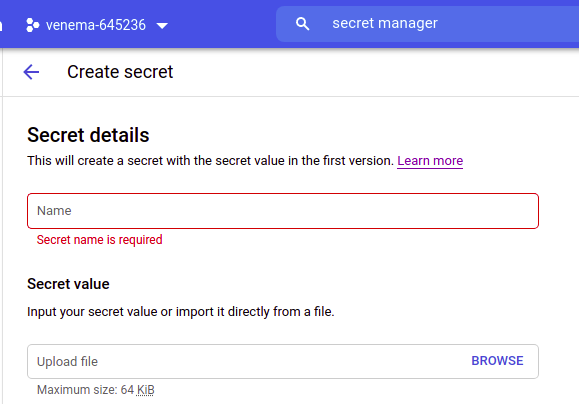

# Restaurant App

[saboresbogota.com](https://saboresbogota.com) (production version)










## Features
* 50+ daily users
* Responsive mobile first design
* Extremely high performance and low latency
* Infinitely auto-scalable infrastructure with zero overhead (Cloud Run by default handles up to 80,000 concurrent requests)
* $1/month total cost (provided the use of GCP resources does not exceed their extremely high free quota thresholds)  
  [Cloud Run free quota](https://cloud.google.com/run/pricing)  
  [Firestore free quota](https://firebase.google.com/docs/firestore/quotas#free-quota)  
  [Cloud Storage free quota](https://cloud.google.com/storage/pricing#cloud-storage-always-free)  
  [Cloud Build free quota](https://cloud.google.com/build/pricing)  
  [Cloud DNS quota](https://cloud.google.com/dns/pricing)  
  Cost breakdown: lowest common denominator here is Cloud Run so the app will have to recieve an estimated 360,000 requests/month to the home page before incurring any cost. This is calculated by taking the approximate request time (500ms) to hit the homepage route and multiplying by the free quota threshold (180,000 vCPU-seconds free per month). CPU consumption is the lowest common denominator since memory consumption per request is much lower. The $1/month is the cost of the domain.
## How to use the app
The top right corner contains a hidden login button for administration of the restaurant

## Database Schema

## Google Firestore UI screenshot


## Services used:  
* Cloud Run
* Cloud Build
* Google Secrets Manager
* Google Cloud Storage
* Google Firestore NoSQL database
* Cloud DNS + Cloud Run domain mapping
  
## GCP configurations required: 
* Deploy your fork of this repository on cloud run, use https://gcping.com/ to choose lowest latency region to deploy to
 
* [Create service account](https://cloud.google.com/iam/docs/creating-managing-service-accounts) for the application that has 'project owner' permission (this is like super admin)
* [Download json key file](https://cloud.google.com/iam/docs/creating-managing-service-account-keys) for above service account and upload it to Secret Manager
  
* [Reference above secret as an environment variable in Cloud Run](https://cloud.google.com/run/docs/configuring/environment-variables), make sure to name the environment variable GOOGLE_APPLICATION_CREDENTIALS_TEXT 
* Enable Firestore in native mode, select same region as cloud run, and create database
  
* [Create Cloud Storage bucket](https://cloud.google.com/storage/docs/creating-buckets#storage-create-bucket-console) manually with two folders, /static and /user-images, set bucket to be publically accessible
  
* Upload all images from /static/assets in source code into assets/ directory of the newly created bucket above, change `src` attribute of all affected `` tags in all .html files in source code to the public url of your own version of assets you just uploaded
* Set environment variables in cloud run SECRET_KEY to a random string, set GOOGLE_STORAGE_BUCKET to the name of the bucket created above; note: SECRET_KEY is needed for flask session to work
* For [domain mapping](https://cloud.google.com/run/docs/mapping-custom-domains) to work, a bug that I personally encountered at time of setup was having to: under cloud domains, make sure to check "Use Cloud DNS (Recommended)" for the domain; when configuring record sets in cloud dns, leave DNS Name field blank and put all 4 ip addresses in the A record set, ditto for AAAA

## Local development configuration required
* Run these commands to create a virtual environment and install dependencies locally
```
python3 -m venv venv
source venv/bin/activate
pip3 install requirements.txt
```
* [Local development environment variables](https://cloud.google.com/docs/authentication/getting-started#setting_the_environment_variable) (added to bottom of .bashrc file in Ubuntu):
```
export FLASK_ENV=development
export FLASK_APP=main.py
export GOOGLE_APPLICATION_CREDENTIALS=key.json
```

* Download service key json file, naming it <<key.json>>, and put it into root of application (so that when developing/testing locally the services are all authenticated), key.json is part of .gitignore so make sure to name correctly or your credentials will be uploaded to github
* Run the development server and open localhost:5000
```
flask run
```

## Testing

A low effort CI/CD pipeline is possible through Cloud Build, which is used when you set up Cloud Run anyway. A github trigger starts the build steps (pushing to main). Then:
1. A container image is built based on the dockerfile in the root of application source code
2. The image is pushed to GCR, Google Container Registry
3. A Test step is manually implemented that takes the freshly built image, runs the `python -m unittest -s ./tests/ -p *_test.py` command to run all tests (that were commited to the tests directory and correctly named).
4. If a test does not pass, it breaks the build process and does not begin Deploy step. However if all is good, then the new revision is deployed and 100% of traffic is routed to the new revision. 


Unless all tests pass, the a new revision of the app does not deploy!!! Very cool.

To create Test step, have to manually add the following to the Cloud Build Trigger cloudbuild.yaml file:
```
steps:
  - name: '$_GCR_HOSTNAME/$PROJECT_ID/$REPO_NAME/$_SERVICE_NAME:$COMMIT_SHA'
    args:
      - python
      - '-m'
      - unittest
      - discover
      - '--verbose'
      - '--start-directory'
      - ./tests/
      - '--pattern'
      - '*_test.py'
    id: Test
    secretEnv:
      - GOOGLE_APPLICATION_CREDENTIALS_TEXT
availableSecrets:
  secretManager:
    - versionName: projects/689769360983/secrets/service_account_key/versions/1
      env: GOOGLE_APPLICATION_CREDENTIALS_TEXT
```
Note: you have to [allow the Cloud Build service account](https://cloud.google.com/iam/docs/granting-changing-revoking-access#granting-console) the permission Secret Manager Secret Accessor  
[inspiration/reference](https://stackoverflow.com/questions/55022058/running-python-unit-test-in-google-cloud-build)

## Local testing
Local development testing is still possible by running `python3 -m unittest` command locally or via the VScode UI

